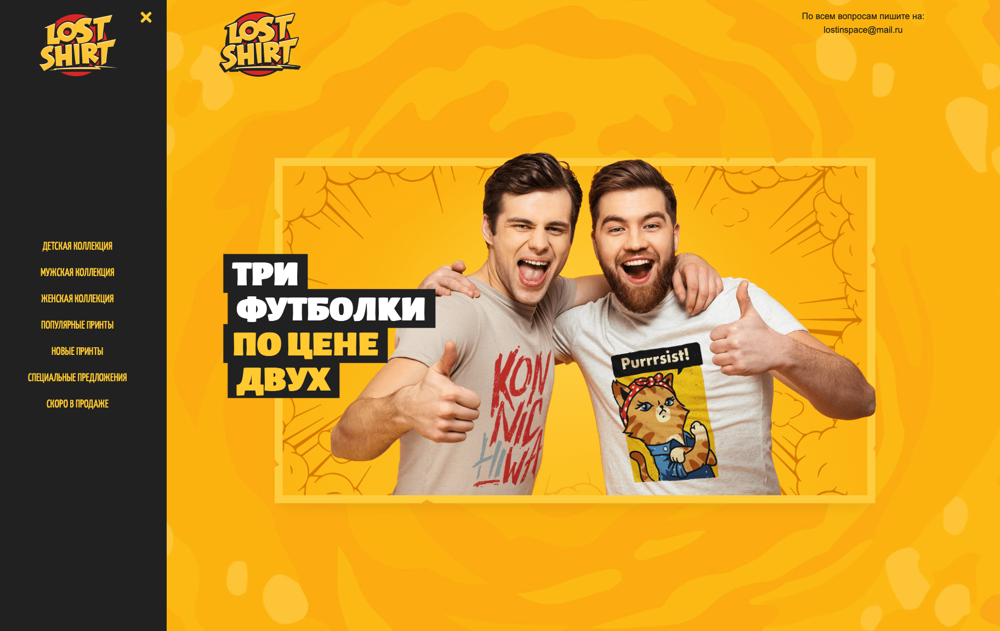
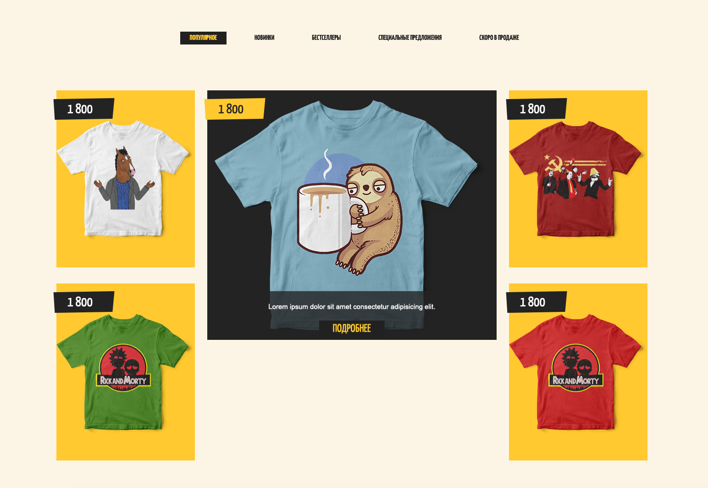
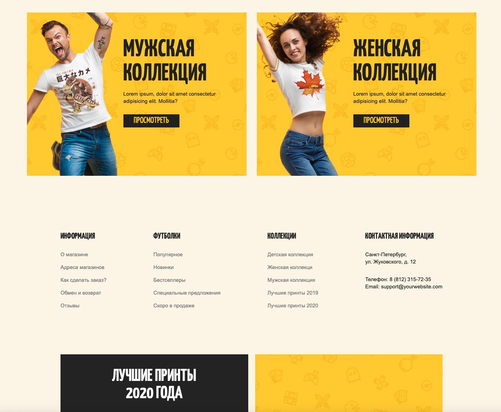

# 🧥 Lost Shirt

Интернет-магазин футболок с ярким дизайном, классной анимацией и удобной навигацией.

## 📌 Описание проекта

Lost Shirt — это стильный лендинг для продажи дизайнерских футболок. Сайт включает:

- 🎯 Промо-блок с акцией
- 🛒 Каталог футболок с фильтрами
- 🧩 Адаптивную вёрстку
- 🌈 Яркие изображения и эффекты наведения
- 📧 Контактный email для заказов и вопросов

🔗  [Открыть демо-версию Lost Shirt на GitHub Pages](https://stockholm19.github.io/lost-shirt/)

## 🛠️ Используемые технологии

- HTML5 / CSS3
- Flexbox
- Адаптивная вёрстка
- Google Fonts (`Roboto`, `Yanone Kaffeesatz`)
- Собственные шрифты (`Alegreya Sans SC`)
- Normalize.css

---

## 💡 Особенности

- Анимация появления описания при наведении на карточку товара
- Интуитивная навигация по разделам: «Популярное», «Новинки», «Бестселлеры» и др.
- Контрастные цветовые акценты с использованием CSS-переменных
- Стильное оформление заголовков и кнопок
- Поддержка русскоязычного контента

---
